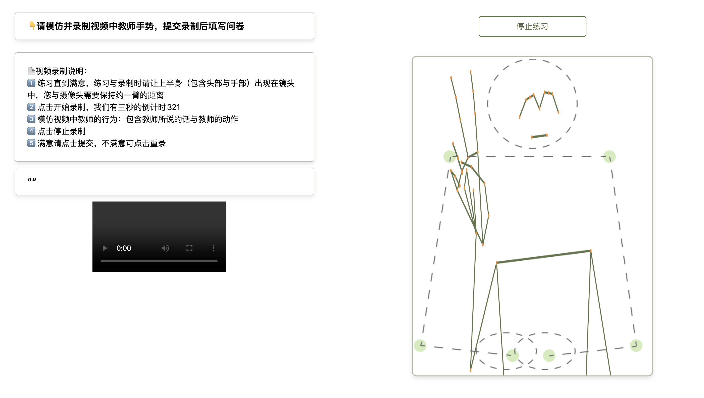

# 🧑‍💻 Online Body Data Collection System



This project is an online system for collecting body data using **Vue3** as the frontend framework and **Express** as the backend. It leverages [Mediapipe](https://github.com/google-ai-edge/mediapipe) models for real-time body posture recognition and uses Axios to send the body coordinates to the server.

## 🖥️ Frontend: Vue

The frontend is developed using Vue3 and includes real-time body posture recognition. It utilizes:

- **Mediapipe Models**: 
  - [BlazePose](https://ai.google.dev/edge/mediapipe/solutions/vision/pose_landmarker/web_js?hl=zh-cn)
  - [HandPose](https://ai.google.dev/edge/mediapipe/solutions/vision/hand_landmarker?hl=zh-cn)

These models provide normalized body coordinates (ranging from 0 to 1), which are sent to the server for further processing. Invalid data is identified by coordinates less than 0 or greater than 1.

## 📡 Backend: Express

1. **MongoDB Connection**: Found in [express/app.js](express/app.js)
2. **API Requests**: URL endpoints are configured in [vue/src/api/axios.js](vue/src/api/axios.js)

### Body Data

The collected body data is normalized, with coordinates ranging from 0 to 1. To convert these into actual pixel values for a video frame, use the following formula:

```python
widthPx = x * width
heightPx = y * height
```

- **Width**: `1280` pixels
- **Height**: `720` pixels

### File Interpretation

- **/express/uploads/**: Contains audio files named in the format `username_dataid_recordingnumber.mp3`, e.g., `1840_10_1.mp3` means the audio file is the first recording by user 1840 during data recording session ID 10.

- **/express/bodyData/**: Contains JSON files named in the format `username_dataid.json`, e.g., `2107_6.json` represents the body data collected by user 2107 during data recording session ID 6.

## 🎥 Video Recall Script

A script is available to reconstruct the collected body data from JSON format.

---

Feel free to customize the README further as needed. If you have any additional details or want specific sections expanded, let me know!

